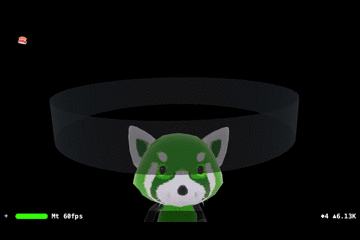

# ARBulletinBoard - Bulletin Board at ARKit

### ARBoardMV: SKVideoNode + Movie File (SpriteKit Texture)

### ARBoardUV: Texture U Coordinate Animation

### ARBoardSK: SKLabelNode Aniamtion (SpriteKit Texture)

Character flows horizontally with character input and screen tap

---

### Extra: ARBoardSK2 - Circular Bulletin Board

